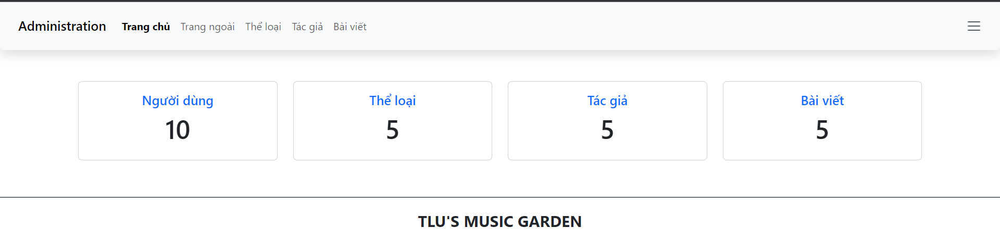
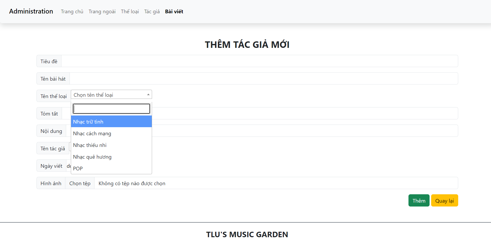

# Ứng dụng có các tính năng chính sau
- Trang đăng nhập, đăng kí
  - Có check validate email, password, username
  - Có check email,username đã tồn tại hay chưa
- Trang quản trị (admin)
  - Hiển thị số lượng người dùng, số lượng thể loại, số lượng bài viết, số lượng tác giả.
  - Có thể thêm, sửa, xóa, tìm kiếm.
  - Đặc biệt trang thêm thông tin có thể chọn các option để thêm vào database giúp cho việc quản lý dễ dàng hơn.
  - Kiểm tra các trường dữ liệu trước khi thêm vào database phải đúng định dạng. 
- Trang chủ
   - Hiển thị các bài hát
   - Khi ấn vào bài hát sẽ hiển thị chi tiết bài hát đó.
# Một số hình ảnh từ ứng dụng
- Trang đăng kí 

- Trang đăng nhập

- Trang quản trị

